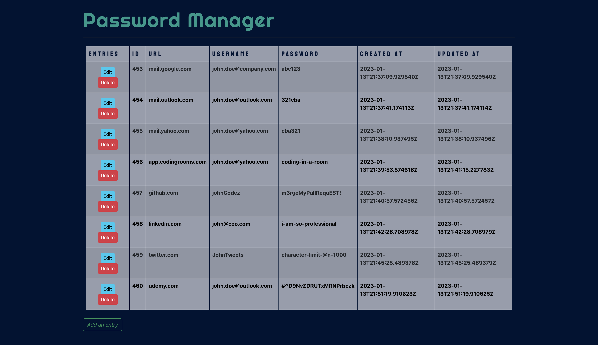

# Java Password Manager & Generator

###### A web app made with java that allows for:

- the generation of a new strong password or passphrase with ability to be customized based on preferences
- passwords and other fields to be added and stored in the backend and displayed in the UI to be accessed later for
  editing or deleting

# Main Features

- Generate a strong password
- Generate a strong passphrase
- User interface for managing data
- All CRUD features: Add, View, Update and Delete password entries and oter fields
- See when first created and last updated

# Tools

- [Random Word Generator API by Heroku](https://random-word-api.herokuapp.com/home)
- Bootstrap (for basic styling/formatting)